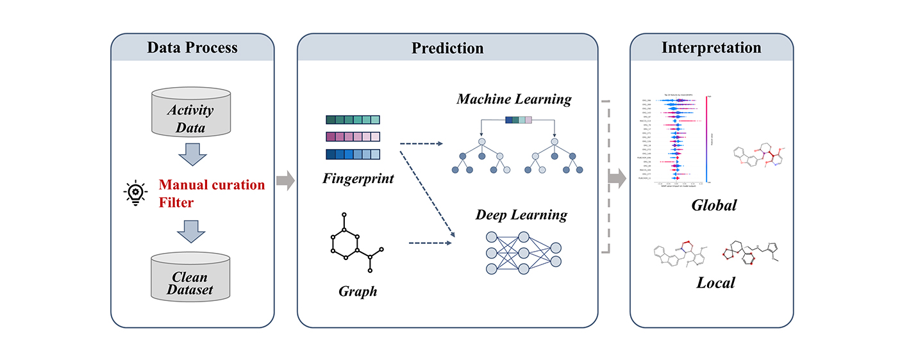

# CLint_Predictor
<p align="center">
  
</p>
An interpretable ensemble learning framework for **human liver microsomal intrinsic clearance (CLint)** prediction, integrating molecular feature engineering, machine learning, and deep learning models.

> 💡 **Quick try**: You can directly perform CLint prediction using our **online web platform** without local deployment: **[https://lmmd.ecust.edu.cn/clint/]**

## ⚙️ Environment Setup
We recommend using **Python ≥ 3.9** and creating a virtual environment.

```bash
numpy==1.26.4
pandas==2.2.2
scipy==1.10.1
scikit-learn==1.2.1
torch==2.6.0
pyg==2.5.2
xgboost==2.1.4
rdkit==2024.3.2
```

## 🚀 Usage
### Step 1: Feature Generation
Run `feature.py` to generate molecular features from SMILES.
```bash
python feature.py
```
- Input: raw molecular data (e.g., SMILES)
- Output: processed feature files saved in the `data/` directory

### Step 2: Ensemble Model Evaluation
After feature extraction, run the ensemble model:
```bash
python ensemble_model.py
```
This script will:
- Load pretrained deep learning and machine learning models
- Apply ensemble gating and applicability domain assessment
- Output evaluation results

## 🧠 Pretrained Models
The `model/` directory provides ready-to-use pretrained weights:

`net_0.pkl`
Pretrained deep learning model
`ml_model_xgb.pkl`
XGBoost model trained on molecular fingerprints
`ad_gate.pkl`
Gating / applicability domain model used for ensemble integration

These files enable **direct reproduction** of prediction results without retraining.

## 🔁 Model Retraining
If you want to retrain models from scratch:

### Deep Learning Model
```bash
python dl_main.py
```

### Machine Learning Model
```bash
python ml_model.py
```
This script retrains traditional machine learning models (e.g., XGBoost).
